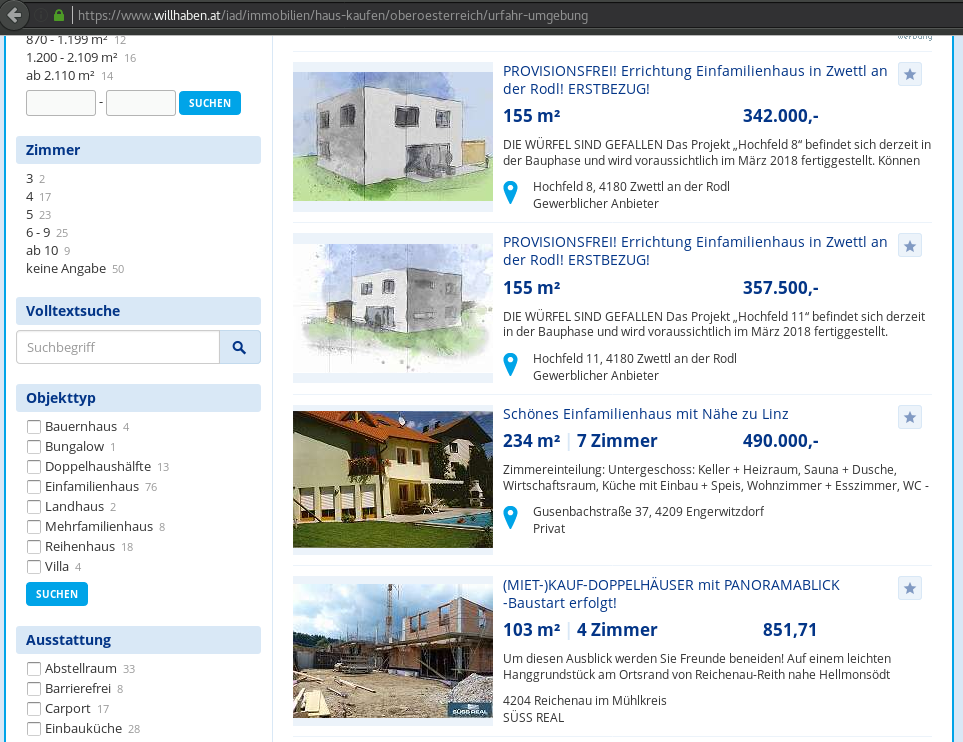
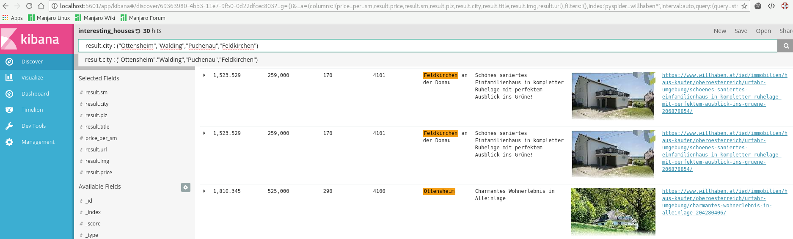
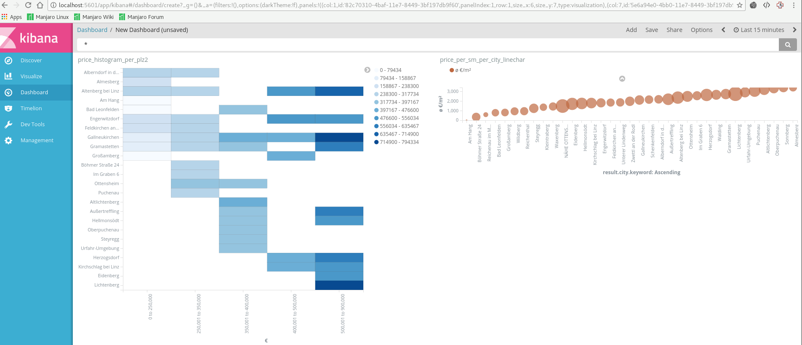

# willhaben real estate analysis

<!-- [](http://www.youtube.com/watch?v=0jJMZ_hQ7I4) -->


<!--  -->


1.  extract information (pysider)
2.  store results (elasticsearch)
3.  analyse (kibana)

## How to run

1.  start docker containers
    ```
    cd willhaben
    docker-compse up
    ```
2.  create and run pyspider project
  * go to http://localhost:5000
  * click "create" and paste content of *pyspider_scripts/willhaben_hauser_kaufen_ooe_uu.py*
  * on overview page: change status to "RUNNING" and click "Run"

3.  check kibana
  * go to http://localhost:5601
  * import saved setting from *docs/assets/kibana_export.json*
  * check "Discover" or "Visualizations" or "Dashboard"


## Stack

### docker
[docker][docker] is used as reproduceable easy-to-use runtime environment.

everything can be started via `docker-compose up`


### pyspider
crawls website and extracts information

*   [pyspider documentation][pyspider]
*   [supported databases](https://github.com/binux/pyspider/tree/master/pyspider/database)
    for usage of undocumented databases search in GitHub e.g. *elasticsearch+resultdb*


### elasticsearch
to store results in a kibana-friendly way
*   [elasticsearch website][elasticsearch]

### kibana
to browse and analyse results

*   [kibana website][kibana]




import configuration via [docs/kibana_export.json](docs/assets/kibana_export.json)


[docker]: https://www.docker.com/
[pyspider]: http://docs.pyspider.org/en/latest/
[elasticsearch]: https://www.elastic.co/products/elasticsearch
[kibana]:https://www.elastic.co/products/kibana
